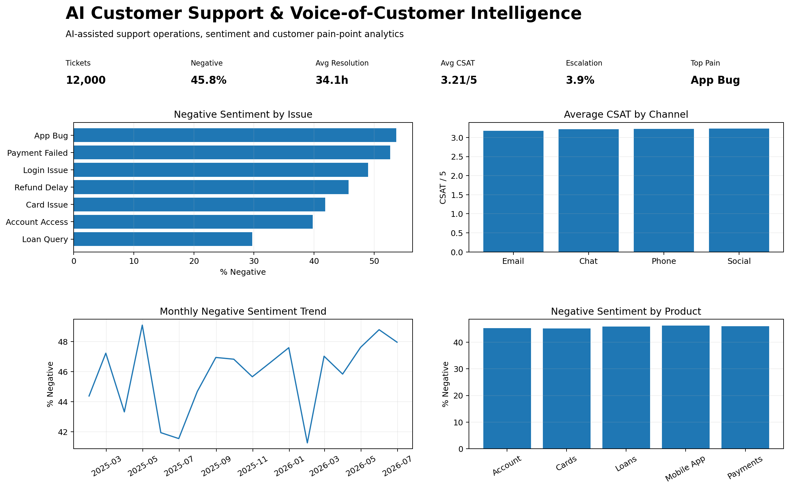

# AI Customer Support & Voice-of-Customer Intelligence

An AI-assisted customer support analytics project that turns support tickets into sentiment, pain-point, resolution and satisfaction insights.

## Business Objective
Identify recurring customer pain points, sentiment patterns, operational bottlenecks and opportunities to improve support quality and customer experience.

## Tech Stack
- SQL
- Python / Pandas
- Sentiment analytics
- Voice-of-Customer analytics
- Support operations analytics
- BI dashboard concepts
- Generative AI as analytical copilot
- GitHub

## Dataset
- 12,000 synthetic support tickets
- January 2025 to June 2026
- Channels, products, issue types, sentiment, priority, resolution and CSAT
- Synthetic data is clearly labeled for portfolio use

## KPIs
- Tickets: 12,000
- Negative sentiment: 45.8%
- Average resolution time: 34.1 hours
- Average CSAT: 3.21/5
- Escalation rate: 3.9%

## Key Findings
- Highest customer pain point by negative sentiment: App Bug
- Channel requiring attention: Email
- Product with highest negative-sentiment rate: Mobile App

## AI-Assisted Workflow
Generative AI was used as an analytical copilot for data profiling, SQL generation, sentiment/pain-point interpretation, KPI selection and business recommendations. Metrics were programmatically validated.

## How Generative AI Could Be Applied
- Ticket summarization
- Intent classification
- Root-cause theme extraction
- Agent-assist response drafting
- Priority triage support
- VoC trend summarization

Human review is required for customer-facing decisions.

## Dashboard Preview

## Business Value
Relevant to AI Business Analyst, Data Analyst, Business Analyst, Customer Analytics, CX Analytics, Product Analytics and Operations Analytics roles.

## Future Enhancements
- Real NLP sentiment model
- Topic modeling / clustering
- LLM-based ticket summarization
- Real-time agent-assist workflow
- Power BI dashboard
- SLA breach prediction
